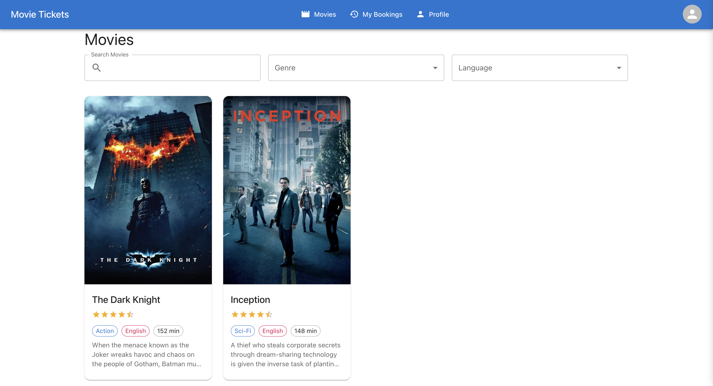
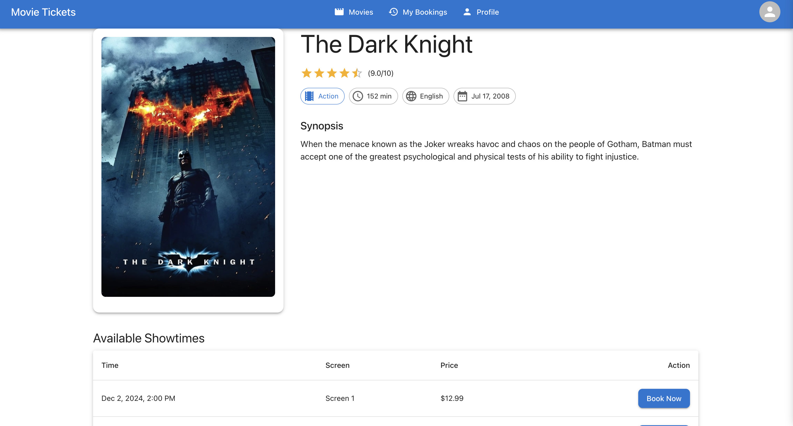
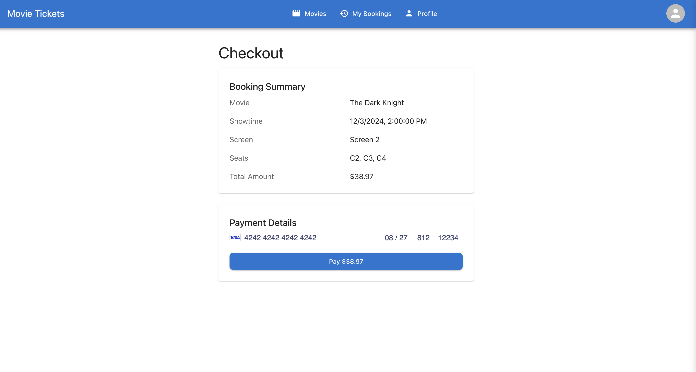

# Real Time Movie Ticket Booking System

A full-stack web application for booking movie tickets, built with Django REST Framework and React TypeScript. Features real-time seat availability updates and instant booking confirmations.

## Features

- 🎬 Browse movies and showtimes
- 🎫 Interactive seat selection with real-time updates
- 💳 Secure payment processing with Stripe
- 👤 User authentication with Firebase
- 📱 Responsive design
- 📖 Booking history
- 🎯 Real-time seat availability and booking status
- 🔄 Instant updates for concurrent bookings

## UI Screenshots

### Home Page


### Showtimes


### Seat Selection


### Checkout


### Booking Confirmation


### Movie Ticket


### My Bookings


## Tech Stack

### Backend
- Django REST Framework
- Firebase/Firestore for real-time database
- Stripe for payment processing
- Firebase Admin SDK for server-side authentication

### Frontend
- React with TypeScript
- Material-UI for styling
- Firebase Authentication
- Firebase Realtime Database for live updates
- Axios for API calls
- Context API for state management

## Project Structure

```
├── backend/
│   ├── apps/
│   │   ├── movies/      # Movie and showtime management
│   │   ├── bookings/    # Booking and payment processing
│   │   └── users/       # User management
│   ├── core/            # Django core settings
│   └── utils/           # Firebase utilities
└── frontend/
    ├── public/
    └── src/
        ├── components/  # Reusable UI components
        ├── contexts/    # React contexts
        ├── pages/       # Application pages
        ├── services/    # API services
        └── utils/       # Utility functions
```

## Setup

### Prerequisites
- Python 3.x
- Node.js
- Firebase account
- Stripe account

### Backend Setup

1. Create a virtual environment and activate it:
```bash
python -m venv venv
source venv/bin/activate  # On Windows: venv\Scripts\activate
```

2. Install dependencies:
```bash
pip install -r requirements.txt
```

3. Copy `.env.example` to `.env` and fill in your credentials:
```bash
cp .env.example .env
```

4. Run migrations and start the server:
```bash
python manage.py runserver 8001
```

### Frontend Setup

1. Install dependencies:
```bash
cd frontend
npm install
```

2. Copy `.env.example` to `.env` and configure environment variables:
```bash
cp .env.example .env
```

3. Start the development server:
```bash
npm start
```

## Environment Variables

### Backend (.env)
- `SECRET_KEY`: Django secret key
- `DEBUG`: Debug mode (True/False)
- `ALLOWED_HOSTS`: Comma-separated list of allowed hosts
- `FIREBASE_*`: Firebase Admin SDK credentials
- `STRIPE_*`: Stripe API keys

### Frontend (.env)
- `REACT_APP_FIREBASE_*`: Firebase client configuration
- `REACT_APP_STRIPE_PUBLISHABLE_KEY`: Stripe publishable key

## API Endpoints

- `/api/movies/`: Movie management
- `/api/showtimes/`: Showtime management
- `/api/bookings/`: Booking management
- `/api/payments/`: Payment processing
- `/api/users/`: User management

## Real-time Features

- Seat availability updates instantly when other users make bookings
- Booking status changes reflect immediately across all clients
- Concurrent booking prevention for the same seats
- Live updates for payment status
- Real-time notifications for booking confirmations

## License

This project is licensed under the MIT License - see the LICENSE file for details.
